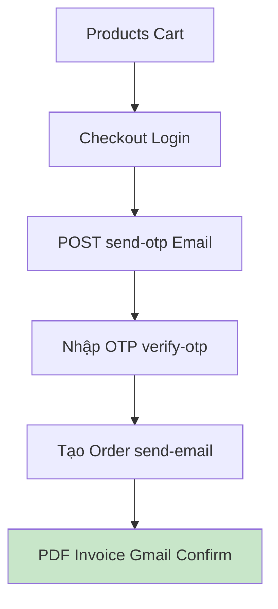

🌟 The Butcher's Editorial - Website Bán Thịt Bò Cao Cấp

[](https://vuejs.org/) [](https://tailwindcss.com/) [](https://pinia.vuejs.org/) [](https://github.com/typicode/json-server) [](https://nodejs.org/)

## 📖 Giới thiệu
**The Butcher's Editorial** là website TMĐT bán thịt bò cao cấp (Úc/Mỹ). Giao diện responsive premium (theme đỏ thịt bò), **Vue 3 + Tailwind + Pinia + Email OTP thực (Gmail)**.

**Features**: Products (10+ cuts, filter/search), Cart/Wishlist, Auth (OTP verified), Invoices PDF, Reviews.

## ✨ Tính năng chính
- ✅ Danh sách sản phẩm filter (premium/average/tough), search, rating.
- ✅ Giỏ hàng/Wishlist user-persisted.
- ✅ Đăng ký/Đăng nhập + **OTP Email thực tế**.
- ✅ Checkout validation (địa chỉ 4 phần, thời gian cutoff 22h).
- ✅ Hóa đơn PDF auto + Email confirmation HTML pro.
- ✅ Responsive mobile-first.

## 🛠 Tech Stack
| Frontend | State/Router | Styling | Backend API | Email | Utils |
|----------|--------------|---------|-------------|-------|-------|
| Vue 3 | Pinia / Vue Router | TailwindCSS | json-server (db.json) | Node/Express/Nodemailer | html2pdf, Axios |

**Files**: 65+ (13 Vue components, 11 beef images, 6 Pinia stores, Node server).

## 🚀 Hướng dẫn chạy đầy đủ (4 Steps/Terminals)

### Prerequisites
- Node.js 16+.

### Bước 1: API Mock Data (Terminal 1)
```bash
npm run json-server
```
→ http://localhost:3000 (products/users).

### Bước 2: Config Email .env (Notepad/Editor)
```
notepad d:\beef-project\server\.env
```
Điền Gmail App Password (16 ký tự) như hướng dẫn bên dưới.

### Bước 3: Frontend (Terminal 2)
```bash
npm install
npm run serve
```
→ http://localhost:8080 (or 8081 if busy).

### Bước 4: Email Server (Terminal 3)
```bash
cd d:\beef-project\server
node server.js
```
→ http://localhost:5000/api/health (test config).

**Demo**: Home → Products → Add Cart → Checkout (OTP) → Invoice PDF/Email.

## ⚙️ Cấu hình Email OTP (Quan trọng!)
**Bước lấy Gmail App Password**:
1. https://myaccount.google.com/security → Bật 2FA.
2. \"Mật khẩu ứng dụng\" → Mail + Windows Computer → Copy 16 ký tự.

**server/.env**:
```
EMAIL_USER=your@gmail.com
EMAIL_PASS=xxxx xxxx xxxx xxxx
OTP_EXPIRE_SECONDS=300
EMAIL_FROM_NAME=\"The Butcher's Editorial\"
```

**Flow**: Checkout → send-otp → Email OTP → verify-otp → send-order-email.

## 📁 Cấu trúc Project
```
beef-project/
├── public/images/     (11 beef JPG: ribeye, phile...)
├── src/components/    (13: HomeComponent, ShoppingCart, HoaDonPDF...)
├── src/store/         (6 Pinia: cart.js, auth.js, hoadon.js...)
├── src/data/db.json
├── server/            (server.js, email.js, Nodemailer)
├── huongdan.md → MERGED
└── README.md ← THIS FILE
```

**Routes**: `/` (Home), `/products/:id`, `/cart`, `/wishlist`, `/hoadon`.

## 📱 Quy trình Mua Hàng
1. Chọn sản phẩm → Cart.
2. Checkout: Địa chỉ (4 phần strict), Thời gian (cutoff 22h).
3. **OTP Email** → Verify.
4. Thanh toán (Cash/Transfer) → PDF + Email confirm.

## 🗺 Sơ đồ Luồng (Mermaid)


## 🔮 Future / Deploy
- Real DB (Mongo/Postgres).
- Payment gateway.
- Vercel frontend + Railway backend.

**MIT License - Student Vue project. Enjoy!** ⭐
